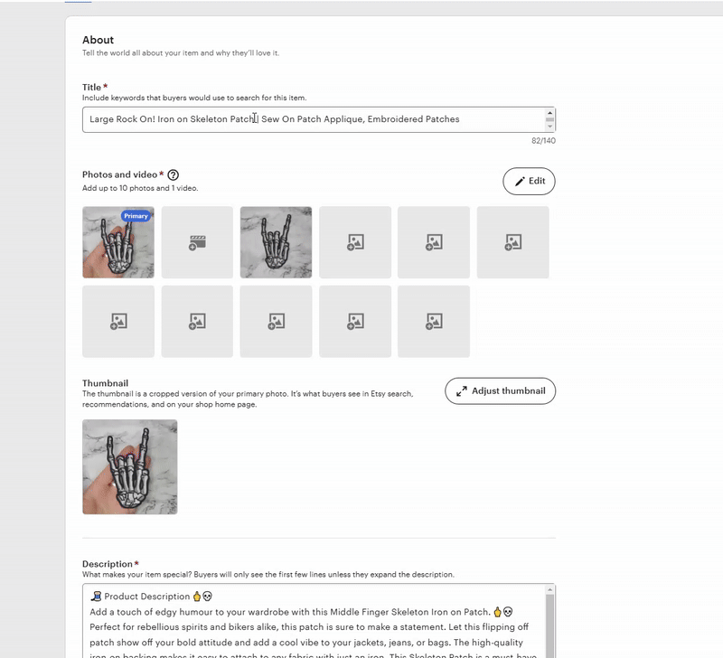

# Etsy Editor AI Support
This script will add a box to generate a Product AI Description using OpenAI's API. It utilises your Product Title and Product Tags to generate a short description.

<p align="center">
    
</p>

## Instructions
```console
1) Get TamperMonkey (https://chromewebstore.google.com/detail/tampermonkey/dhdgffkkebhmkfjojejmpbldmpobfkfo?hl=en) or GreaseMonkey (https://addons.mozilla.org/en-GB/firefox/addon/greasemonkey/)

2) Get an API Key from https://platform.openai.com/api-keys

3) Copy and paste the code from the 'Etsy AI Description Generator.js' into a new Script inside TM/GM

4) Edit the api_key variable to your own (Line #14)

5) Go to Line #128 for the Function called 'MakeChatGPTRequest()', edit this prompt to what you need specifically for your descriptions.

6) Save Script

7) 🌟 Create a New Listing OR Edit a Listing to Have the AI Description Box Appear.
```

By default the script is set up to use | as the Title Delimiter and gpt-3.5-turbo as the ai_model. I believe this AI Model is now completely free to use with API requests but it used to cost around $0.007-0.01 per call.

* When people structure their Etsy Titles they usually use some sort of Delimiter before they place Keywords inside the title, for exampe 'Cute Driving Frog Iron on Patch | Sew On Patch Applique, Embroidered Patches', Everything after the Delimiter (|) will be ignored when making the request to OpenAI.

## Recommendations
Etsy has said that they use the first 200 Characters of your Description as guidance on how to place your product within their Search Algorithm, unlike most platforms this was actually pretty nice of them to just tell us exactly what to do instead of trial and error so make sure it's filled with High Traffic / Low Competition ACCURATE Keywords, spamming low quality or irrelevant keywords can actually be detrimental your products ability to rank. And always make sure your Description is at the very top of the listing or its better off not even existing at all.

## Notes   
I made this quite a while ago and it has saved me an immense amount of time, even if the code is sloppy and the design isn't the best, it's genuinely useful and I have personally used it to generate over £13,000+ in Revenue on Etsy with nothing but organic SEO.

There is a small bug that sometimes the Script doesn't activate, to fix this simply refresh the page. I'm almost certain this bug happens when you use the Forward/Back button as the windowEventListener 'load' isn't called so the whole script fails to activate. If you want to fix this bug yourself replace the windowEventListener with a MutationObserver, I just really don't mind refreshing every once in a while so I'm going to leave the bug in, but let the record show I know how to fix it, I'm just lazy.